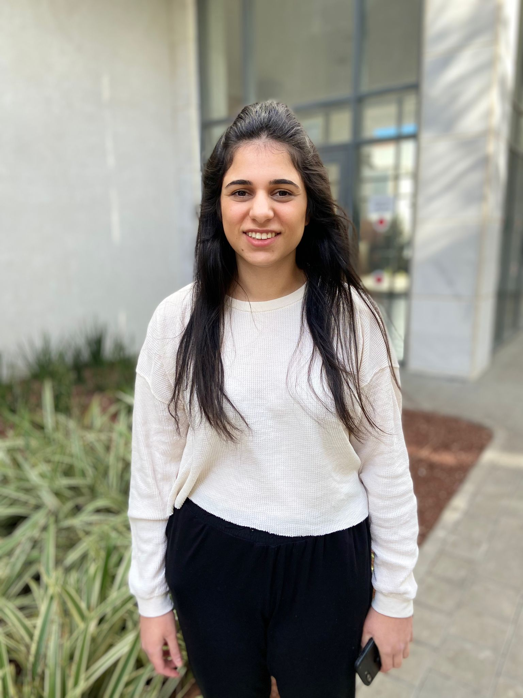

# Noy Ravensary GitHub Site

Hi there :)

I am Noy, I am a master student in [Nir Fluman's lab](https://www.weizmann.ac.il/Biomolecular_Sciences/Fluman/home), working on membrane proteins.

Meet my protein of interest : FtsH

The protein in the image is an important protease for breaking down membrane-bound proteins in E.coli. We are investigating how it identifies unfolded proteins that need to undergo degradation.

This is a link to my solutions repository : [Python-Course-Assignments](https://github.com/NoyRavensary/Python-Course-Assignments)

This are some of my class mates:

[Omer Sapir](https://omersapir.github.io/)

[Shahar Garin](https://shahargarin.github.io/)

[Yuval Bernard](https://yuvalbernard.github.io/)
